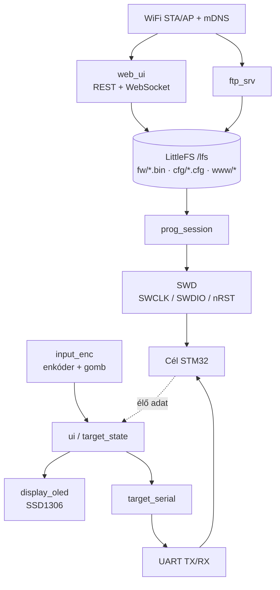

# ESP32-S3 önálló SWD programozó + konfigurátor

PC nélküli, hordozható eszköz, amely **STM32 mikrokontrollereket programoz fel SWD-n** (a firmware-t saját LittleFS tárolójából olvasva), **soros konfig-hídként** kommunikál a futó cél-alkalmazással, helyileg **OLED + gombos enkóderről** kezelhető, és **WiFi-n web-UI-t (REST + WebSocket) és FTP-szervert** ad a fájlok eléréséhez.

Egyetlen ESP32-S3-N16R8 modul (16 MB flash, 8 MB octal PSRAM), ESP-IDF alapon. A flash-kód CMSIS `.FLM` / ST `.stldr` blobokból fut a cél STM32 RAM-jában (RAM flash loader). Támogatott STM32 családok: **F0, F1, F3, F4, F7, L0, L1, L4, G0**.

> A két célinterfész fizikailag külön van: **SWD** = firmware-flashelés (mag megállítva); **UART** = konfig + élő adat a *futó* célalkalmazással. A session-logika tiltja a flash + config egyidejűséget ugyanazon a célon.

---

## Funkciók

- **SWD flashelés PC nélkül**: `.bin` firmware felprogramozása STM32-re, a flash-algoritmust a cél RAM-jában futtatva (connect-under-reset kötelező).
- **Multi-család támogatás**: F0/F1/F3/F4/F7/L0/L1/L4/G0, DEV_ID alapú cél-felismeréssel és méret-detektálással.
- **Soros konfig-híd**: bináris `.cfg` fájlok fel-/letöltése a futó cél STM32 alkalmazásába/ból, keretezett UART-protokollon (`SOF | LEN | CMD | PAYLOAD | CRC16`).
- **Élő adat**: a cél periodikus státusz-frame-jei egy közös `target_state` modellbe folynak, amit az OLED és a web-UI WebSocket egyszerre fogyaszt.
- **Helyi UI**: SSD1306 128×64 OLED + gombos enkóder (görgetett fájllista, cél-típus, %-os progress bar, élő adat).
- **WiFi web-UI**: statikus felület + REST API + WebSocket (élő adat, programozási progress, log).
- **FTP-szerver**: a LittleFS fölött, firmware és `.cfg` drag-drop fel-/letöltéshez.
- **LittleFS tár**: power-fail biztos, wear-leveling, ~13 MB a 16 MB flashen (`/lfs/fw`, `/lfs/cfg`, `/lfs/www`).

---

## Architektúra



### Komponens-rétegek (SWD/FLM mag, alulról fölfelé)

A SWD/FLM mag **platformfüggetlen** — kizárólag SWD-regisztertranzakció. Az egyetlen platformspecifikus rész a 4-függvényes PHY HAL (`swd_phy`).

```
swd_phy  →  adiv5  →  cortexm_debug  →  flm_runner  →  prog_session
(dedic_gpio HAL) (DP/AP transport) (halt/reset, mem R/W) (FLM futtatás) (orchestráció)
```

A 16 komponens (`components/`):

| Komponens | Szerep |
|---|---|
| `swd_phy` | dedic_gpio HAL (platformspecifikus PHY) |
| `adiv5` | DP/AP transport, switch, ACK/parity |
| `cortexm_debug` | halt/reset, mem R/W, DCRSR/DCRDR |
| `flm_runner` | call_function + FLM futtatás |
| `flm_blobs` | generált C tömbök (PrgCode/PrgData/DevDsc) |
| `target_db` | DEV_ID → FLM + flash-size reg |
| `prog_session` | SWD programozás orchestráció (end-to-end) |
| `target_serial` | UART híd: `.cfg` fel/le, élő adat |
| `target_state` | közös élő-adat modell (UI + WS forrása) |
| `storage_lfs` | LittleFS mount + fájl-API + lock |
| `input_enc` | enkóder ISR/PCNT + gomb → eseménysor |
| `display_oled` | SSD1306 driver + UI képernyők |
| `ui` | helyi UI taszk (menü, render) |
| `net_wifi` | STA/AP, provisioning, mDNS |
| `web_ui` | esp_http_server: REST + WebSocket |
| `ftp_srv` | FTP a LittleFS fölött |

---

## Hardver / lábkiosztás

Modul: **ESP32-S3-N16R8** (16 MB flash, 8 MB octal PSRAM).

### Javasolt lábkiosztás

| Funkció | Láb | Periféria / megjegyzés |
|---|---|---|
| SWCLK (out) | GPIO4 | `dedic_gpio` bundle |
| SWDIO (bidir) | GPIO5 | `dedic_gpio` out+in, turnaround |
| nRST (out, OD) | GPIO6 | open-drain + pullup, connect-under-reset |
| Cél UART TX | GPIO17 | `target_serial` (UART1, sima 3.3 V) |
| Cél UART RX | GPIO18 | `target_serial` (sima 3.3 V) |
| (tartalék) | GPIO15 | szabad (korábbi RS485 DE elhagyva) |
| OLED I2C SDA | GPIO8 | SSD1306 128×64 |
| OLED I2C SCL | GPIO9 | I2C0, 400 kHz |
| Enkóder A | GPIO10 | ISR (vagy PCNT) |
| Enkóder B | GPIO11 | irány |
| Enkóder SW (gomb) | GPIO12 | ISR + debounce, short/long |
| Cél Vref érzékelés | GPIO1 (ADC1) | feszültség-jelenlét + szint |
| Cél táp EN (opc.) | GPIO13 | load switch, 3.3 V |
| Státusz LED | GPIO14 / WS2812 | fázis/hiba kijelzés |

### Cél-csatlakozó

```
SWCLK · SWDIO · nRST · UART_TX · UART_RX · GND · VTARGET (sense/feed)
```

MVP: **3.3 V-os cél**, SWCLK/SWDIO közvetlenül, soros ~33–100 Ω-mal. Eltérő Vdd-hez SWDIO bidir szintfordító kell. A cél Vdd-jét ADC-vel ellenőrizd, mielőtt tranzakciót indítasz.

### Bekötés (ASCII)

```
        ESP32-S3-N16R8                         Cél STM32
   ┌───────────────────────┐             ┌──────────────────┐
   │ GPIO4  SWCLK ──────────┼── 33-100Ω ─┤ SWCLK            │
   │ GPIO5  SWDIO ──────────┼── 33-100Ω ─┤ SWDIO            │
   │ GPIO6  nRST  ──────────┼── OD+pull ─┤ NRST             │
   │ GPIO17 UART_TX ────────┼────────────┤ RX  (futó app)   │
   │ GPIO18 UART_RX ────────┼────────────┤ TX  (futó app)   │
   │ GND ───────────────────┼────────────┤ GND              │
   │ GPIO1  VREF (ADC) ─────┼────────────┤ VDD (sense)      │
   └───────────────────────┘             └──────────────────┘

        ESP32-S3-N16R8                  OLED + Enkóder
   ┌───────────────────────┐      ┌──────────────────────────┐
   │ GPIO8  SDA ────────────┼──────┤ SSD1306 SDA              │
   │ GPIO9  SCL ────────────┼──────┤ SSD1306 SCL (I2C0 400k)  │
   │ 3V3 / GND ─────────────┼──────┤ SSD1306 VCC / GND        │
   │ GPIO10 ENC_A ──────────┼──────┤ Enkóder A                │
   │ GPIO11 ENC_B ──────────┼──────┤ Enkóder B                │
   │ GPIO12 ENC_SW ─────────┼──────┤ Enkóder gomb (SW)        │
   └───────────────────────┘      └──────────────────────────┘
```

---

## Fenntartott lábak (NE oszd ki!)

Az N16R8 octal PSRAM és a belső flash több GPIO-t lefoglal — ezekre perifériát kötni hibás működést okoz:

- **Octal PSRAM (R8): GPIO33–GPIO37 foglalt** — sose oszd ki perifériára.
- **Belső flash SPI: GPIO26–GPIO32 foglalt.**
- **Native USB pad: GPIO19/20 fenntartva** a jövőbeli USB host (pendrive) funkcióhoz.
- **Strapping: GPIO0, 3, 45, 46** — kerüld vagy óvatosan kezeld.

**Szabadon kiosztható:** GPIO1–18, 21, 38–42, 47, 48.

---

## Build & flash

ESP-IDF **v5.5.1** (ellenőrizve). Az IDF itt van telepítve: `C:\Users\jenei\esp\v5.5.1\esp-idf`.

> **Fontos:** a környezet nem perzisztens a PowerShell-hívások között — minden shellben aktiválni kell az `export.ps1`-t, és az aktiválás + `idf.py` hívás **egy parancsban** legyen.

```powershell
# 1) Környezet aktiválás (minden új shellben)
. "C:\Users\jenei\esp\v5.5.1\esp-idf\export.ps1"

# 2) Target beállítás (csak elsőre / target váltáskor)
idf.py set-target esp32s3

# 3) Build
idf.py build

# 4) Flash + monitor (cseréld a portot)
idf.py -p COM5 flash monitor
```

Egy soros build:

```powershell
. "C:\Users\jenei\esp\v5.5.1\esp-idf\export.ps1"; idf.py build
```

### Kulcs sdkconfig (`sdkconfig.defaults`)

```
CONFIG_ESPTOOLPY_FLASHSIZE_16MB=y
CONFIG_SPIRAM=y
CONFIG_SPIRAM_MODE_OCT=y          # octal PSRAM (R8) — kötelező R8-hoz
CONFIG_SPIRAM_SPEED_80M=y
CONFIG_SPIRAM_USE_MALLOC=y
CONFIG_PARTITION_TABLE_CUSTOM=y   # partitions.csv
CONFIG_HTTPD_WS_SUPPORT=y         # web_ui /ws élő adat + progress
```

### Particionálás (`partitions.csv`, 16 MB)

| Name | Type | SubType | Offset | Size |
|---|---|---|---|---|
| nvs | data | nvs | 0x9000 | 0x6000 |
| phy_init | data | phy | 0xf000 | 0x1000 |
| factory | app | factory | 0x10000 | 0x300000 (3 MB) |
| storage | data | littlefs | 0x310000 | 0xCF0000 (~13 MB) |

### Build-buktatók (megtapasztalt)

- **Hiányzó xtensa toolchain**: ha az IDF tools eredetileg csak riscv targetre lett telepítve, az `export.ps1` nem teszi a PATH-ra az xtensa fordítót (`"Did not find file Compiler/-ASM"`). Megoldás: egyszer futtasd le az `install.ps1 esp32s3`-at, utána jó.
- **`partitions.csv` komment**: az adatsorok végén **ne legyen sor végi `# komment`** — a parser a 6. oszlopot flag-nek veszi. A kommentet külön sorba tedd.

---

## Használat

### Helyi UI (OLED + enkóder)

- **Enkóder** görget, **rövid gomb** = belép/kiválaszt, **hosszú gomb** = vissza/mégse.
- **Idle/status**: WiFi (STA/AP, IP), cél detektálva (típus), soros link.
- **Főmenü**: `Program firmware` / `Cél konfig` / `Élő adat` / `Beállítások`.
- **Program firmware**: görgetett fájllista (`/lfs/fw`) → SWD connect → detektált cél-típus + flash méret → megerősítés → flash, **%-os progress bar** (Erase/Program/Verify) → eredmény (OK/HIBA + kód).

### Web-UI

- Elérés: **`http://swdprog.local`** (mDNS, STA módban), vagy AP-fallback esetén **`http://192.168.4.1`** (AP SSID: **SWDPROG-AP**).
- Statikus UI a `/lfs/www`-ból. REST végpontok:
  - `GET /api/files` — fájllista (fw/cfg)
  - `POST /api/upload` — multipart fw/cfg feltöltés
  - `GET /api/download?path=` / `DELETE /api/file?path=`
  - `POST /api/program {file}` — SWD flash indítás (progress WS-en)
  - `POST /api/cfg/push {file}` / `GET /api/cfg/pull` — célkonfig fel/le
  - `WS /ws` — élő adat + progress + log streamelés
- **Biztonság**: a felület képes célt törölni/flashelni → AP-módban erősen ajánlott Basic Auth / token (tervezett finomítás).

### FTP

- LittleFS-háttérrel, firmware és `.cfg` drag-drop fel-/letöltés. Plaintext → csak LAN-on. A `storage_lfs` közös lockját használja (nem ütközik a web-UI-val).

### Tipikus folyamat: firmware feltöltés és flashelés

1. Töltsd fel a `.bin`-t a `/lfs/fw`-be (web-UI `POST /api/upload`, FTP, vagy enkóder-menü forrásból).
2. Helyi UI-ban válaszd ki: `Program firmware` → fájl → a készülék SWD-n connectel és kiírja a detektált cél-típust + flash méretet.
3. Erősítsd meg → erase/program/verify, a progress az OLED-en és a web WebSocketen is látszik.

---

## Flash-loaderek (FLM)

A flash-algoritmus a cél STM32 RAM-jában fut. **Eltérés a tervtől:** a terv eredetileg CMSIS `.FLM` loadereket írt elő (ABI: `Init/UnInit/EraseSector/EraseChip/ProgramPage/Verify`, **0 = siker**), de a fejlesztőgépen a **STM32CubeProgrammer `.stldr`** loaderei voltak elérhetők (DEV_ID szerint nevezve, pl. `bin/FlashLoader/0x431.stldr`). Ezért az **ST loader-ABI** lett bekötve:

- Belépési pontok: `Init / Write(addr,size,buf) / SectorErase(start,end) / MassErase / Verify`
- **Siker = 1** (nem 0), `StorageInfo` eszköz-leíró
- A `flm_algo_t` mindkét ABI-t leírja (`abi`, `success_ret`, `load_addr`, abszolút belépési pontok), a CMSIS `.FLM` ág megmaradt.

Jelenleg **42 céltípus** generálva — a `target_db` által ismert összes DEV_ID-hez van loader (~71 KB):

| Család | DEV_ID-k |
|---|---|
| F0 | 0x440, 0x442, 0x444, 0x445, 0x448 |
| F1 | 0x410, 0x412, 0x414, 0x430 |
| F3 | 0x422, 0x432, 0x438, 0x446 |
| F4 | 0x413, 0x419, 0x421, 0x423, 0x431, 0x433, 0x441, 0x458 |
| F7 | 0x449, 0x451, 0x452 |
| L0 | 0x417, 0x425, 0x447, 0x457 |
| L1 | 0x416, 0x427, 0x429, 0x436, 0x437 |
| L4 | 0x415, 0x435, 0x462, 0x464, 0x470 |
| G0 | 0x456, 0x460, 0x466, 0x467 |

### Regenerálás

A `tools/flm_extract.py` `.stldr` (vagy CMSIS `.FLM`) → C tömb generátor (pyelftools kell):

```bash
pip install pyelftools
python tools/flm_extract.py 0x431.stldr 0x413.stldr ... \
    -o components/flm_blobs/flm_generated.c \
    --header components/flm_blobs/flm_generated.h
```

A `.stldr` fájlok a STM32CubeProgrammer telepítés `bin/FlashLoader/` mappájában találhatók.

> A nyers `.stldr` (és `.FLM`) loaderek **ST-proprietary** források → **nem kerülnek a repóba**, csak a belőlük generált C tömbök (`components/flm_blobs/`).

---

## Projekt-állapot

- **Szoftveresen kész**: a teljes váz zöldre fordul (esp32s3), mind a 16 komponens implementálva, az end-to-end flash-út be van kötve.
- **Hátravan a HW-validáció**: a SWD/FLM mag valódi STM32-n még nincs igazolva (A0–A5 kész-kritériumok a tervben; F411 / 0x431 cél ajánlott a kezdéshez, logikai analizátorral DPIDR/IDCODE). Az ST `Init`/`Verify` visszatérési szemantikáját élesben kell igazolni.
- **Finomítások**: `target_db` néhány flash-size reg címe ellenőrzendő; web auth (Basic/token) AP-módra; multi-család teszt; RDP/hibakódok; több céltípus a táblába.

Teljes spec, lábkiosztás és fázisos ütemterv: **[`reference/ESP32S3_SWD_PROG_Plan.md`](reference/ESP32S3_SWD_PROG_Plan.md)** (lásd még [`CLAUDE.md`](CLAUDE.md)).

---

## Licenc / jegyzet

- A generált FLM/flash-loader adat **ST eszközökből** (STM32CubeProgrammer) származik, **saját használatra**; a nyers loaderek ST-proprietary, nincsenek a repóban.
- Architektúra-referenciák a maghoz (a tervből): **pyOCD** és **probe-rs** (FLM-betöltés + `call_function` + CMSIS-pack parse minta), **Black Magic Probe** (család-driverek + ADIv5, GPLv3 — termékhez figyelni a licencre), **FlashOS.h** (ARM CMSIS-Pack, az FLM ABI definíciója), **u8g2** (SSD1306 + fontok + menü).
